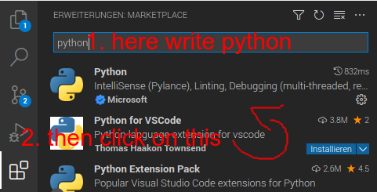

# Factory

## Summary
* [Introduction](#Introduction)
* [Installation](#installation)
     * [VS Code](#First-you-install-a-development-environment-like-VS-Code.)
     * [Python](#python)
* [Updates](#updates)
* [Definitions of functions](#Here-are-the-definitions-of-the-functions)
     * [Other Functions](#other-functions)

#
## Introduction

#### Factory is a program that brings Fischertechnik's 536632 to life.

All you need is the Fischertechnik factory 526632, a PC, Python, a terminal and a development environment.

#
## installation

#### First you install a development environment like VS Code.
#### If you use a raspberry pi then type in a terminal

```
sudo apt update
```
#### and then
```
sudo apt install code
```

\
if you are using a other device with a different operating system then you can also click on the [link](https://code.visualstudio.com/download) to download it from the official website

### python


#### Now you should install python.

#### you can do it by clicking on the extension icon


#### then type "Python" in the searchbar and then click on Python from the publisher microsoft




#### now click on install and wait for it finished

#
## updates

If you want to update VS Code you only have to write

```
sudo apt update
```
#### and then
```
sudo apt upgrade code
```

#### in your terminal

\
By default VS Code is set up to auto-update for macOS and Windows users.


#
## Here are the definitions of the functions


### without pneumatics
\
O_1 = turntable rotates to the right\
O_2 = turntable turns to the left\
O_3 = conveyor belt\
O_4 = Polisher(saw idk)\
O_5 = Furnace move in\
O_6 = Furnace move out\
O_7 = Crane to the left\
O_8 = crane to the right\
O_9 = red lamp (burner)

### with pneumatics
\
O_10 = compressor on\
O_11 = suction cup on\
O_12 = crane suction cup holder down\
O_13 = Furnace door up\
O_14 = Pusher to push material
## other functions
I_10 = turntable detection button\
\
\
\
1 at light barrier means = not interrupted (so it gets current)\
0 at light barrier means = interrupted (so it gets no current)